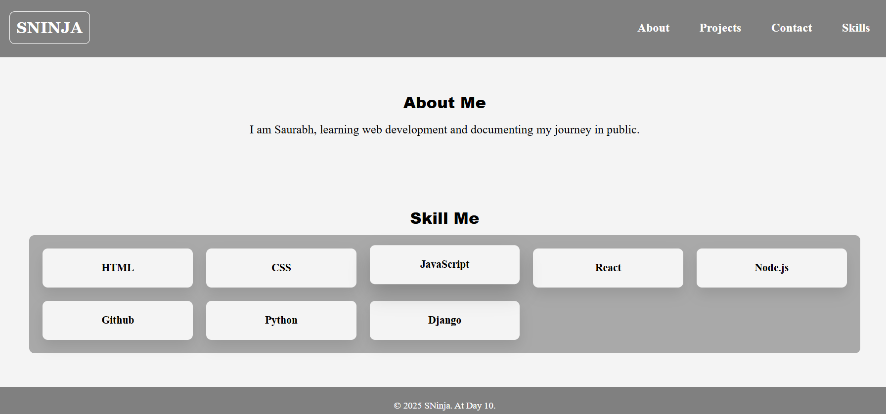

#  Responsive Portfolio Website

This is my first **portfolio project** built with **HTML5 + CSS3**.  
It’s a simple, responsive one-page portfolio designed as part of my coding journey.

---

##  Screenshot

---

## Features
- Responsive design (Desktop, Tablet, Mobile)
- Clean navigation bar
- About Me section
- Skills/Services grid (auto-fit responsive)
- Footer with credits

---

## Built With
- HTML5
- CSS3 (Flexbox + Grid)
- Media Queries for responsiveness

---

##  Project Structure
---

##  What I Learned
- How to build a responsive layout using **Grid** and **Flexbox**
- Using **auto-fit + minmax()** for responsive grids
- Mobile-first design with **media queries**
---

## Live Demo
👉 [Click to View]((https://ninjasyntax.github.io/-Responsive-Portfolio-Page/))  

---

##  Connect With Me
Follow my journey on [Twitter](https://x.com/NinjaSaurabh12)  
